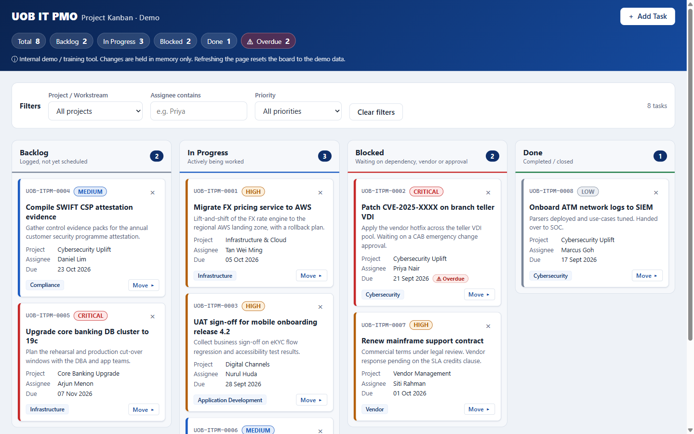

# kanban4 v2 — IT PMO Portfolio Board (Demo)

A single-file project portfolio board for tracking IT project tasks, built for internal demo and training use. Version 2 is redesigned for senior-management reading: a plain-English status headline, key figures and workstream health sit above the Kanban board, in a light orange theme. It is not an official system and carries no official branding.

**Live demo:** https://hochoonheng.github.io/kanban4-v2/



## Features

- **Portfolio overview** (counts every task, ignoring filters)
  - Headline that says how many open tasks need attention and why (overdue, blocked, critical)
  - Key figures: open, completed (with % done), blocked, overdue, critical open
  - "Where the work sits" status-mix bar with counts and percentages
  - Workstream health table, worst first, rated **Off track**, **At risk** or **On track** in text as well as colour. Select a workstream to filter the board to it.
- Four columns: **Backlog**, **In Progress**, **Blocked** and **Done**
- Add tasks from a slide-out form with title, description, workstream, category, assignee, priority, status and due date, with inline validation
- Move cards by drag and drop, or with the keyboard-friendly **Move ▸** menu
- Delete cards with an inline confirmation
- Filter by workstream, assignee and priority; column badges show the filtered counts
- Priority pills and an **Overdue** badge that use text as well as colour
- A one-time help dialog after 10 seconds on the page, with the IT support hotline (12345678) and a tap-to-call button
- Floating WhatsApp button (bottom right) that opens a list of suggested IT support questions; choosing one starts a WhatsApp chat with +65 1234 5678 with the question pre-filled
- Optional email notification for each new task via [FormSubmit](https://formsubmit.co/)
- Responsive layout (two columns below 1100px, one below 768px) and a print stylesheet for status packs
- Accessible: labelled inputs, visible focus rings, `aria-live` announcements, Esc closes menus and the form

## Run locally

Serve the folder over http and open `index.html`, for example:

```bash
npx http-server . -p 8765
```

Opening the file directly (`file://`) also works in most browsers. The board starts with seed data dated relative to today. Nothing is saved: refreshing the page resets the board (this is by design).

## Email notifications

1. In `index.html`, set `FORMSUBMIT_ENDPOINT` to `https://formsubmit.co/ajax/<your-address>`.
2. Run `node tools/update-csp.js` (the script changed, so its CSP hash must be updated).
3. Add a task. FormSubmit sends a one-time activation email; click the link in it. Nothing is delivered until you do.

While the endpoint still holds the `YOUR_EMAIL@example.com` placeholder, no request is sent and the board shows a warning toast. A failed notification never breaks the board — the card is still added locally. Notifications are limited to one every 15 seconds and 20 per page load.

## Visit alerts

The page can email IT support when someone stays on it for 10 seconds or more, with the page link and non-personal details (page title, time, board status, referring site, language, screen size, device type). It is **off** until you set `VISIT_ALERT_ENDPOINT` in `index.html` to `https://formsubmit.co/ajax/<alerts-inbox>` and run `node tools/update-csp.js`. The address is visible in the public page source. The first alert triggers FormSubmit's one-time activation email. When alerts are on, the demo banner tells visitors. Automated browsers and visitors using Global Privacy Control are never reported.

In Claude Code, the `it-support` agent (`.claude/agents/it-support.md`) checks the live site and alert setup, and summarises alert emails you paste in.

## Editing

The page has a strict Content Security Policy that allows only the exact inline style and script. **After editing the `<style>` or `<script>` block, run:**

```bash
node tools/update-csp.js
```

Otherwise the browser blocks the edited block and the page appears unstyled and inert.

## Deployment

Every push to `main` deploys the site to GitHub Pages through [`.github/workflows/pages.yml`](.github/workflows/pages.yml). Only `index.html` is published.

## Tech

- Vanilla HTML, CSS and JavaScript in one file — no frameworks, libraries, CDNs or web fonts
- All colours and spacing come from CSS custom properties

## Security

- **Content Security Policy** (meta tag): `default-src 'none'`, with the inline style and script allowed by sha256 hash only, `connect-src` limited to FormSubmit, and `base-uri`, `form-action` and `object-src` locked down
- `strict-origin` referrer policy and `noindex, nofollow`
- Clickjacking guard: the board will not run inside a frame
- All user input is HTML-escaped before rendering; control and bidi-override characters are stripped; assignee names use a character allowlist; dates must be real calendar dates
- Hardened `fetch`: endpoint allowlist, no credentials, no redirects, 10-second timeout, client-side rate limit
- No storage APIs and no third-party code

The repository is scanned for secrets, personal data and unsafe code before each publish. Please report any security issue by opening a GitHub issue (without including sensitive details) or contacting the repository owner.
